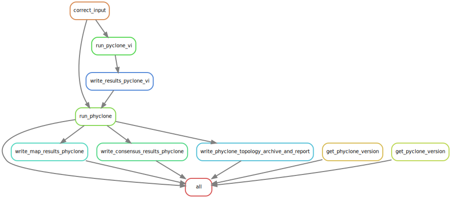

# PhyClone-Workflow
A [Snakemake](https://snakemake.readthedocs.io/en/stable/) pipeline that bundles the running of [PyClone-VI](https://github.com/Roth-Lab/pyclone-vi) and [PhyClone](https://github.com/Roth-Lab/PhyClone), for pre-clustering and phylogenetic reconstruction of multi-sample bulk-sequencing data. 

--------

# Overview

1. [Setup](#setup)
    * [Environment Setup](#environment-setup)
    * [Acquire Workflow](#acquire-workflow)
2. [Usage](#usage)
   * [Configuration](#configuration)
   * [Run Workflow](#run-workflow)
3. [Workflow Output](#workflow-output)
   * [Workflow output folder structure](#example-workflow-output-folder-structure)
4. [Workflow Rulegraph](#workflow-rulegraph)

-------
# Dependencies
* [conda](https://github.com/conda-forge/miniforge), version >24.7.1
* [Snakemake](https://snakemake.readthedocs.io/en/stable/), version >=9.0
-------

# Setup

This pipeline requires that [conda](https://github.com/conda-forge/miniforge) and [Snakemake](https://snakemake.readthedocs.io/en/stable/) be installed; the [Bioconda](https://bioconda.github.io/#usage) package channel must also be configured.

## Environment Setup

1. Ensure that you have a working `conda` installation, you can do this by installing [Miniforge](https://github.com/conda-forge/miniforge#install).
2. Configure the [Bioconda channel](https://bioconda.github.io/#usage) and set strict channel priority:
   ```
   conda config --add channels bioconda
   conda config --add channels conda-forge
   conda config --set channel_priority strict
   ```
3. Install [Snakemake](https://snakemake.readthedocs.io/en/stable/):
   ```
   conda create -c conda-forge -c bioconda --name snakemake snakemake'>=9.0'
   ```

-------
## Acquire Workflow

1. Create a working directory for the workflow:
   ```
   mkdir -p path/to/project-workdir
   cd path/to/project-workdir
   ```
2. Clone the workflow repository through git:
   ```
   git clone --depth 1 https://github.com/Roth-Lab/PhyClone-Workflow.git
   ```
--------

# Usage

## Configuration

1. Modify the configuration file, [config.yaml](config/config.yaml) to suit your dataset.
2. The following configuration fields **must** be configured per experiment:
   * `input_file`: A valid filepath to the input file for the pipeline, the format of which can be found in both the [PyClone-VI](https://github.com/Roth-Lab/pyclone-vi#input-format) and [PhyClone](https://github.com/Roth-Lab/PhyClone#main-input-format) repositories.
   * `experiment_name`: Name for the experiment (will form the experiment root folder, e.g. results/<experiment_name>)
3. The default program options listed under `pyclone-vi` and `phyclone` in the configuration file should suit most cases. However, the following values may be of interest to adjust depending on the data being analysed and computing resources available:
   * `pyclone-vi` options of interest:
     * `num_threads`: Number of threads (compute cores) to use during inference.
     * `seed`: Can be used to seed the random number generator for reproducible results.
   * `phyclone` options of interest:
     * `num_chains`: Number of independent parallel PhyClone sampling chains to use, each chain will use a CPU core. PhyClone will benefit from running multiple chains; we recommend ≥4 chains, if the compute cores can be spared.
     * `seed`: Can be used to seed the random number generator for reproducible results.
4. The remaining configuration options have been named to mirror the options of their respective programs, to read more on the available options and their use cases:
   * [PhyClone documentation](https://github.com/Roth-Lab/PhyClone#running-phyclone)
   * [PyClone-VI documentation](https://github.com/Roth-Lab/pyclone-vi#running-pyclone-vi)

> [!TIP]
> An example input file can be found in the PyClone-VI repository, [here](https://github.com/Roth-Lab/pyclone-vi/blob/master/examples/tracerx.tsv).

---------
## Run Workflow

> [!TIP]
> A basic workflow-profile has been set up [here](workflow/profiles/default/config.v8+.yaml), adjust as needed.

1. Navigate to the project directory and activate the snakemake environment:
   ```
   cd path/to/project-workdir/PhyClone-Workflow
   conda activate snakemake
   ```
2. Run a dry-run of the pipeline to confirm the ruleset and outputs are as you expect:
   ```
   snakemake --cores <number-of-CPU-cores-to-use> -n 
   ```
3. Run the pipeline:
   ```
   snakemake --cores <number-of-CPU-cores-to-use>
   ```
4. Following the pipeline run, you can additionally create an interactive visual HTML report that bundles together and reports on the pipeline results.
To create this report, run:
    ```
    snakemake --report report.zip
    ```
---------
# Workflow Output

The main outputs of the pipeline are point estimate PhyClone clonal phylogenies and/or the PhyClone topology report/archive.
More on the contents of these output files can be found in the [PhyClone repository](https://github.com/Roth-Lab/PhyClone#phyclone-output).


### Example workflow output folder structure:
```
results/<experiment_name>/
├── benchmarks
│   ├── phyclone
│   │   ├── run_phyclone.benchmark.txt
│   │   ├── write_consensus_results_phyclone.benchmark.txt
│   │   ├── write_map_results_phyclone.benchmark.txt
│   │   └── write_phyclone_topology_archive_and_report.benchmark.txt
│   └── pyclone-vi
│       ├── run_pyclone_vi.benchmark.txt
│       └── write_results_pyclone_vi.benchmark.txt
├── logs
│   ├── main_snakefile_logs
│   │   ├── correct_input.stderr.log
│   │   └── correct_input.stdout.log
│   ├── phyclone_logs
│   │   ├── get_phyclone_version.log
│   │   ├── run_phyclone.stderr.log
│   │   ├── run_phyclone.stdout.log
│   │   ├── write_consensus_results_phyclone.stderr.log
│   │   ├── write_consensus_results_phyclone.stdout.log
│   │   ├── write_map_results_phyclone.stderr.log
│   │   ├── write_map_results_phyclone.stdout.log
│   │   ├── write_phyclone_topology_archive_and_report.stderr.log
│   │   └── write_phyclone_topology_archive_and_report.stdout.log
│   └── pyclone-vi_logs
│       ├── get_pyclone_version.log
│       ├── run_pyclone_vi.stderr.log
│       ├── run_pyclone_vi.stdout.log
│       ├── write_results_pyclone_vi.stderr.log
│       └── write_results_pyclone_vi.stdout.log
└── pipeline_outputs
    ├── input
    │   ├── cleaned_input.tsv.gz
    │   └── filtered_variants.tsv.gz
    ├── phyclone
    │   ├── phyclone.version.txt
    │   ├── trace.pkl.gz
    │   └── tree_outputs
    │       ├── Consensus
    │       │   ├── results_table.tsv.gz
    │       │   └── tree.nwk
    │       ├── MAP
    │       │   ├── results_table.tsv.gz
    │       │   └── tree.nwk
    │       └── Topology_Report
    │           ├── sampled_topologies.tar.gz
    │           └── topology_report.tsv.gz
    └── pyclone-vi
        ├── clusters.tsv.gz
        ├── pyclone-vi.version.txt
        └── trace.h5
```

--------
# Workflow Rulegraph



